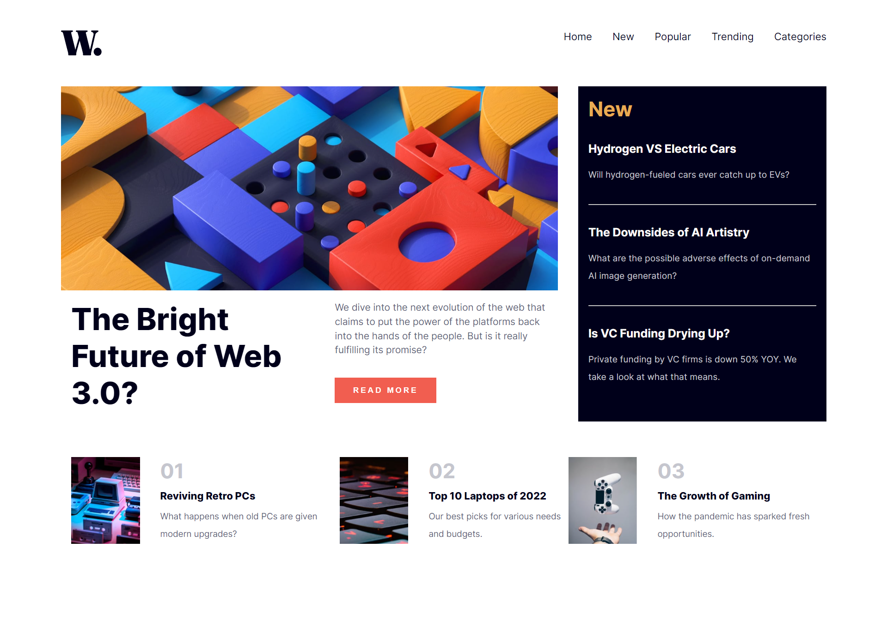

# News Homepage Challenge

This is my submission for the [News homepage challenge from Frontend Mentor](https://www.frontendmentor.io/challenges/news-homepage-H6SWTa1MFl), done with Next.js 

## Description

The News Homepage Challenge is a design challenge where participants are given a design for a news website's homepage and are asked to recreate it using HTML, CSS, and possibly JavaScript. For this particular submission, I used Next.js to build the application.

## Screenshots

|  |  |
| ------------------------------ | ----------------------------- |
| Desktop version                | Mobile version                |

## Live Link

View the live version of this project at: `https://news-homepage-challenge-ruby.vercel.app/`

## Technologies Used

- Next.js
- React
- CSS 

## Getting Started

First, run the development server:

```bash
npm run dev
# or
yarn dev
# or
pnpm dev
```
Open [http://localhost:3000](http://localhost:3000) with your browser to see the result.

## Acknowledgements

This project was developed with reference to the following resources:

- [Frontend Mentor](https://www.frontendmentor.io/solutions/news-homepage-qhqHFQBzhX) for providing the challenge
- [React documentation](https://reactjs.org/docs/getting-started.html) for reference and guidance
- [NextJS documentation](https://nextjs.org/docs) for reference and  guidance

## Credits

- Frontend Mentor - [@malekbentaher](https://www.frontendmentor.io/profile/malek-bt)
- Linkedin - [@malek-bentaher-361028222](https://www.linkedin.com/in/malek-bentaher-361028222/)

